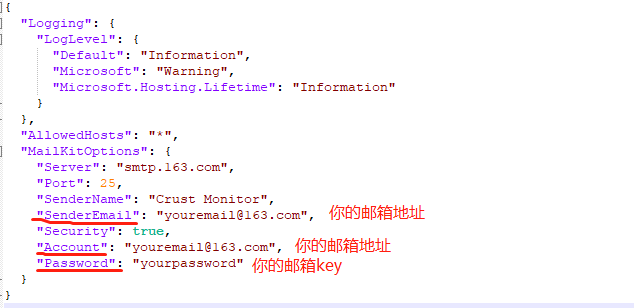
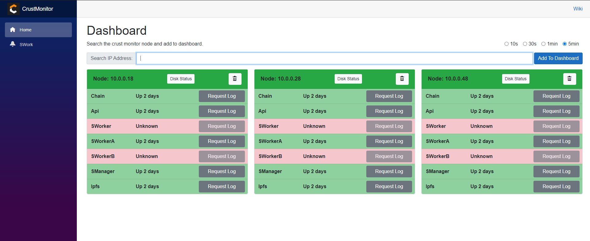
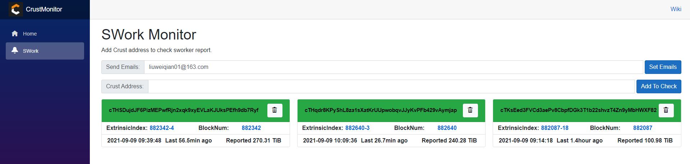

# Crust Monitor

### 用于监控和运维crust节点，可以监听链上异常数据，邮件通知

#### 代码开源

https://github.com/lwqlwq60/crust-monitor

https://github.com/lwqlwq60/crust-monitor-node

使用原理： 由 crust-monitor 和 crust-monitor-node 两部分组成

* crust-monitor-node 相当于每个节点的数据采集器，可以安装在任何cowner member 或者 isolation节点中。
* crust-monitor 相当于所有节点信息的汇总，只需安装一个即可，但必须保证monitor与node之间网络是通的。

# 如何使用

#### 安装Node

1. ```bash
   git clone https://github.com/lwqlwq60/crust-monitor-shell.git
   ```

2. ```bash
   cd crust-monitor-shell
   ```

3. ```bash
   sudo bash install-node.sh
   ```

   **！！！注意：**

   1. docker版本需高于20.10.4
   2. 第一次安装node会重启docker服务，目的是开启docker remote api。请确保关闭所有docker容器，第一次安装之后支持热更新，不需要重新docker服务。
   3. 确保51888端口不被占用

#### 安装Monitor

1. ```bash
   git clone https://github.com/lwqlwq60/crust-monitor-shell.git
   ```

2. ```bash
   cd crust-monitor-shell
   ```

3. ```bash
   sudo bash install-monitor.sh
   ```

4. ```bash
   vim cd /opt/crust-monitor/appsettings.json
   ```

5. 在appsettings.json中进行发送邮件的配置



6. ```bash
   sudo docker restart crust-monitor
   ```

   **！！！注意：**

   1. 需要在邮箱中开启smtp服务，并且获取密钥


#### 使用

假设你把monitor安装在10.0.0.28上，这时候可以用浏览器打开http://10.0.0.28



1. 在Search Ip Address 输入框内填写 Node 的ip地址（比如10.0.0.18），点击右侧按钮 Add To Dashboard，也可以填写10.0.0，它将自动搜索10.0.0.1-10.0.0.254中可用的Node节点。

2. 右上角为dashboard刷新的间隔
3. 可以点击Disk Status查看磁盘状况，或者点击Reqeust Log请求各crust组件的日志。


#### Swork菜单内可以设置监听链上数据



1. 在Crust Address内填 member的节点地址，点击右侧Add To Check。
2. 在Send Emails内填要通知的邮箱，点击右侧Set Emails， 如果需要配置多个，用英文逗号隔开。

Swork检查的逻辑是每10分钟查链上数据，检查member的工作量上报，如果遇到上报失败，或者超过2小时未上报，会进行邮件通知。


